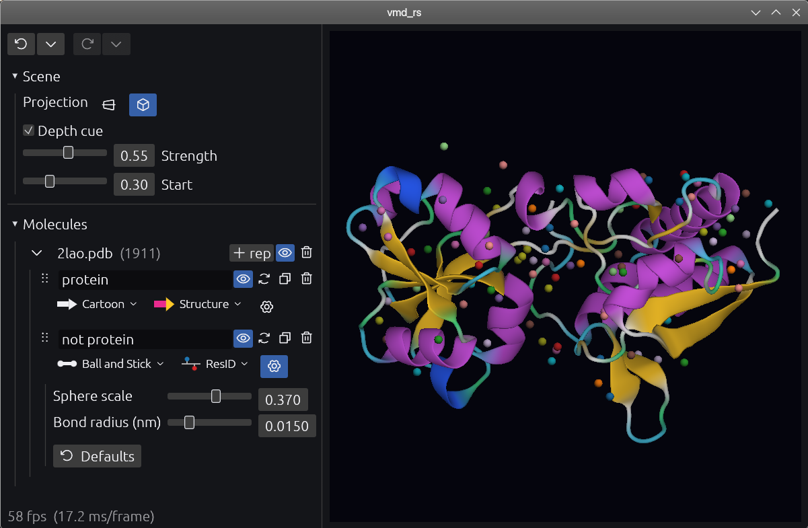

# molar_vis — a modern molecular viewer in pure Rust

[](https://www.rust-lang.org/)
[](#license)
[](https://github.com/yesint/molar)
[](#building)

A modern, **legacy-free** molecular visualizer modeled after [VMD](https://www.ks.uiuc.edu/Research/vmd/),
written in **pure Rust**. The molecule is drawn with hand-written **GPU ray-cast
impostors** (WGSL) and real-time cartoon ribbons — no OpenGL fixed pipeline, no X11,
no C/C++/Tcl. It runs natively on Linux, Windows and macOS and compiles to the web
(WebAssembly).

The binary is called `molar_vis`. It is built on [molar](https://github.com/yesint/molar)
— a Rust molecular-analysis library by the same author — for file I/O, atom selections,
topology and secondary-structure assignment, and renders on
[`eframe`/`egui`](https://github.com/emilk/egui) + [`wgpu`](https://github.com/gfx-rs/wgpu).



## Why another molecular viewer?

VMD is the gold standard for molecular visualization, but it carries three decades
of accumulated legacy: a C/C++ core glued together with Tcl, an OpenGL fixed-function
rendering path, and a build that fights modern toolchains and platforms. `molar_vis`
is a clean-room reimagining of the *good parts* of VMD on a modern foundation:

- **Pure Rust, end to end** — memory-safe, no segfaults, no manual memory management,
  one `cargo build`.
- **A modern GPU pipeline** — atoms and bonds are ray-cast as analytic impostors in
  fragment shaders that write true depth, so they occlude perfectly and stay crisp at
  any zoom; cartoon ribbons are a real triangle mesh that interleaves with them. No
  fixed-function OpenGL, no immediate mode.
- **Portable by construction** — `wgpu` targets Vulkan, Metal, DX12 and WebGPU, so the
  same code runs on the desktop and in a browser.
- **VMD muscle memory preserved** — the same selection language, the same mouse
  navigation, the same representations and coloring schemes.

It is deliberately small and focused: a fast, beautiful, hackable viewer, not a
reimplementation of every VMD feature.

## Features

**Representations** — five styles, all GPU-accelerated:

| Style | Rendering | Notes |
|---|---|---|
| **Lines** | 1‑px GL lines | the lightweight default, VMD-authentic |
| **Licorice** | cylinder + sphere impostors | uniform bond radius |
| **Ball and Stick** | sphere + cylinder impostors | scaled VDW balls + thin sticks |
| **VDW** | sphere impostors | space-filling, true van der Waals radii |
| **Cartoon** | indexed triangle mesh | secondary-structure ribbons (see below) |

**Cartoon ribbons** — a faithful port of VMD's *NewCartoon*: a per-chain
modified Catmull–Rom spline through the Cα trace, a carbonyl-derived ribbon frame with
running-average orientation, elliptical cross-sections that morph by secondary-structure
class, and β-strand arrowheads. Secondary structure is assigned by molar's built-in
**DSSP** (Kabsch–Sander) or **`dss`** (a clean-room port of PyMOL's algorithm),
selectable per representation.

**Coloring schemes** — Element (CPK), Chain, ResID, ResName, Index, B-factor, and
Secondary structure, each with a drawn descriptive icon in the picker.

**Selections** — molar's VMD/Pteros-style selection language: `protein`, `backbone`,
`water`, `name CA`, `resid 1:50`, `chain A`, `within 5.0 of ...`, and much more.
Selections are compiled once and re-evaluated only when needed.

**Camera & display**
- Quaternion arcball camera with VMD mouse mapping (rotate / pan / zoom).
- **Perspective and orthographic** projection (orthographic is the default).
- Adjustable **depth cueing** (linear fog) for depth perception.

**Scene**
- Multiple molecules, each with multiple representations.
- Per-representation visibility, color, style and inline parameters.
- Drag-to-reorder representations; duplicate; per-rep gear popup for tunables.
- Full **undo/redo** with named history (Ctrl+Z / Ctrl+Shift+Z / Ctrl+Y).

**Efficient by default** — the scene is only re-rendered when geometry, the camera, the
viewport size or visibility actually change. **Idle costs zero GPU**; the UI repaints on
input. The impostor pipeline scales to hundreds of thousands of atoms.

## Building

With a [Rust toolchain](https://rustup.rs) installed and a checkout of
[molar](https://github.com/yesint/molar) next to this repository (it is a local path
dependency):

```sh
git clone https://github.com/yesint/molar    # path dependency: ../molar
git clone https://github.com/yesint/molar_vis
cd molar_vis
cargo build --release
```

Run it, passing one or more structure files (each file becomes one molecule):

```sh
cargo run --release -p molar_vis -- protein.pdb            # one molecule
cargo run --release -p molar_vis -- system.gro ligand.pdb  # two molecules
```

Supported input formats are whatever molar reads — including **PDB**, **GRO**, and
(with the appropriate molar features) trajectory and topology formats.

### WebAssembly

The core crate is WASM-safe; you can check it builds for the web with:

```sh
cargo build -p molar_vis_core --target wasm32-unknown-unknown
```

## Selections

`molar_vis` uses molar's selection language directly. A few examples:

```
all
protein and not hydrogen
backbone and chain A
resid 1:50 and name CA
resname ALA GLY
water
within 5.0 of (resname LIG)
```

See the [molar selection-syntax reference](https://github.com/yesint/molar#selection-syntax)
for the full grammar (keywords, comparisons, geometric and distance-based selections,
logical operators, `same ... as`, PBC options, …).

## Navigation

Standard VMD-style mouse mapping inside the 3D viewport:

| Action | Mouse |
|---|---|
| Rotate (arcball) | left-drag |
| Pan | middle-drag |
| Zoom | right-drag / scroll wheel |

## How it works

A few design points worth knowing if you want to hack on it:

- **"Strategy A" rendering.** The 3D scene is drawn into our *own* offscreen color +
  `Depth32Float` textures and then composited into the egui frame as an image. egui's own
  render pass has no depth attachment, so owning the targets is what gives us full depth
  control — required for the impostors.
- **Impostors.** Spheres and cylinders are camera-facing billboards; the fragment shader
  ray-casts the analytic surface and writes `frag_depth`, so geometry occludes correctly
  (against itself *and* the cartoon mesh) and never tessellates. Both perspective
  (eye-ray) and orthographic (parallel-ray) cameras are handled in the shader.
- **Depth cueing** is applied in every fragment shader from a shared camera uniform,
  fading geometry toward the background color by eye-space distance.
- **A dirty-flag scene graph.** N molecules × M representations; each rep owns a compiled
  selection and its GPU buffers. Selection recompilation and geometry rebuilds are driven
  by per-rep dirty flags, and the whole frame is skipped when nothing changed.
- **Units.** All geometry is in nanometers (molar's native unit) end to end.

The workspace is two crates: `molar_vis_core` (the WASM-safe library — all logic and
rendering) and `molar_vis` (the thin native binary: argv + logging).

## Status

The MVP is complete: load molecules, all five representations, every coloring scheme,
selections, multi-molecule / multi-representation scenes, undo/redo, perspective /
orthographic projection, and depth cueing. Trajectory playback is the next major
milestone.

This is a young project under active development; expect rough edges.

## Built on molar

`molar_vis` is a showcase for [molar](https://github.com/yesint/molar). Everything below
the rendering layer — reading files, building topology, guessing bonds, evaluating
selections, assigning secondary structure — is molar. If you want to *analyze* rather
than *view* molecules in Rust (or Python), start there.

## License

Distributed under the **Artistic License 2.0**, the same license as molar.

## Acknowledgements

Inspired by [VMD](https://www.ks.uiuc.edu/Research/vmd/) (Theoretical and Computational
Biophysics Group, University of Illinois) — its representations, selection language and
navigation are the model this project follows on a modern stack. Built with
[egui](https://github.com/emilk/egui), [wgpu](https://github.com/gfx-rs/wgpu) and
[molar](https://github.com/yesint/molar).
